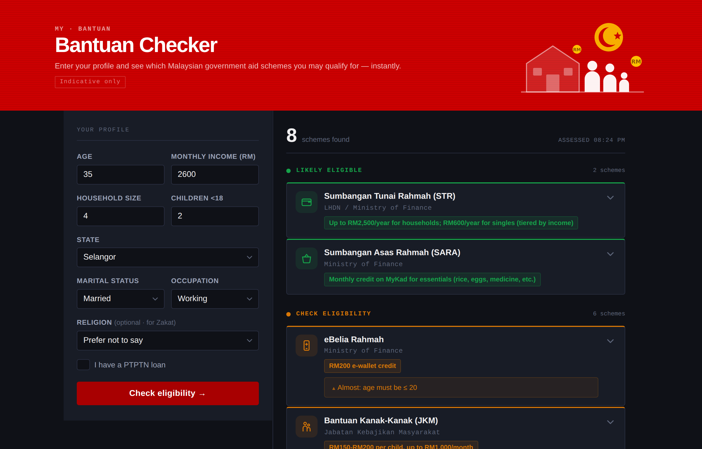
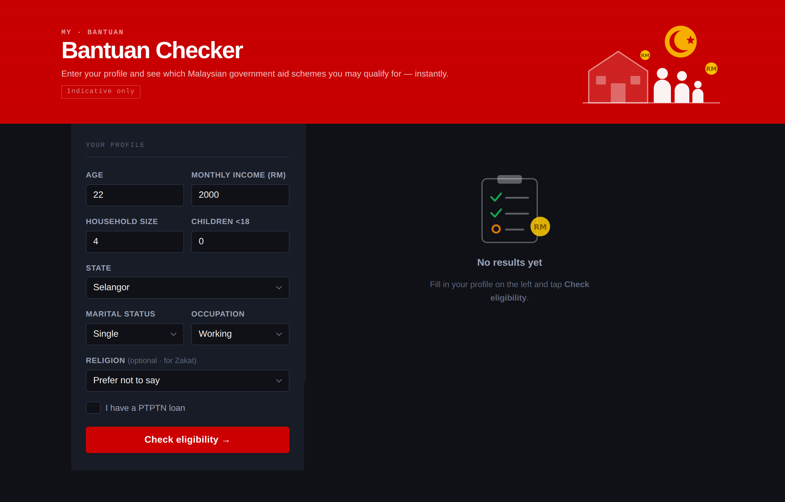
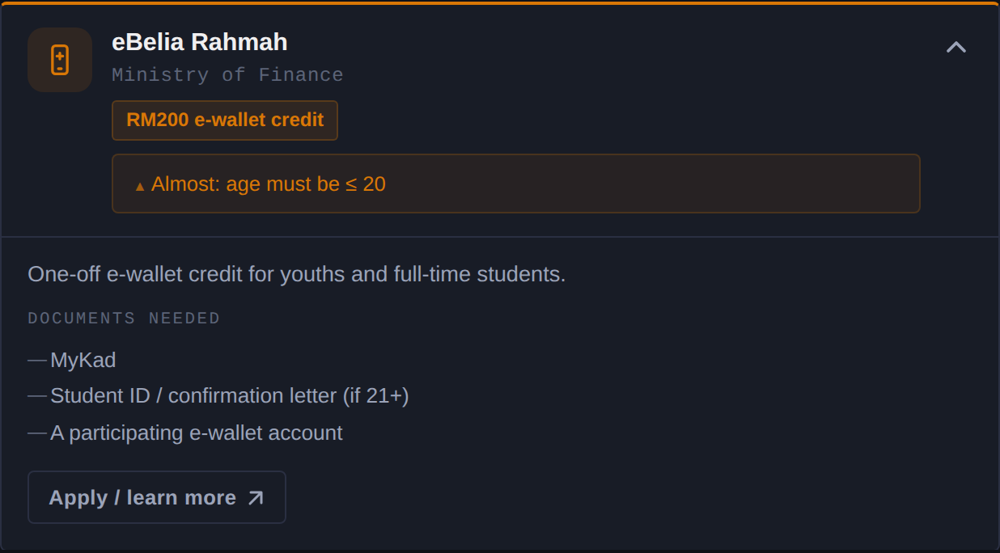
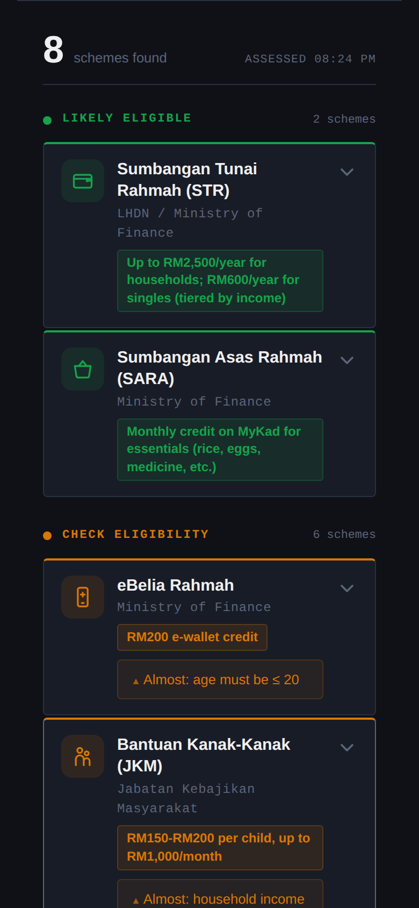

# Bantuan Checker 🇲🇾

**Find the Malaysian government assistance you qualify for — in 30 seconds.**

Built in 40 minutes at *Build with IBM Bob + Mini Bob-a-thon* (IBM × Tec D × Developer Kaki, 28 Sep 2026) by Shermaine Yap.

## Screenshots

**Results: two-tier eligibility** (a married 35-year-old, RM2,600/month income, 2 children)



| Home (before checking) | "Check Eligibility" card expanded | Mobile |
|---|---|---|
|  |  |  |

## The problem

Malaysia runs dozens of assistance schemes (STR, SARA, eBelia Rahmah, JKM allowances, MADANI Medical, eKasih, zakat, PTPTN relief…) across different agencies, each with its own portal and its own income/age rules. Many eligible people — especially seniors, students and B40 families — never apply because they don't know a scheme exists or which documents to bring. Money that is budgeted goes unclaimed.

## The solution

One short form → a personalised list of schemes you likely qualify for, the benefit amount, the documents to prepare, and a direct link to apply.

- **Likely Eligible** – every criterion met
- **Check Eligibility** – one criterion short, with the exact reason (e.g. *household income must be ≤ RM2,500*), so you know what would change your status

## Why it's not slop

- **Data-driven rules engine.** Every scheme is a JSON record in `rules.json` (`any_of` / `all_of` conditions with `gte`, `lte`, `in`, `eq`). Adding a new scheme or updating a threshold after Budget 2027 needs zero Python changes — an NGO or a state government could maintain it.
- **Explainable.** Results return which rule matched (or which condition failed). No black box.
- **Deployable today.** Stateless FastAPI service, no database, no API keys, no personal data stored. Could run on a MyKad kiosk, a Telegram bot, or embedded in a state portal.
- **Tested.** `pytest` suite covers the engine, the API contract and validation.

## Run it

```bash
pip install -r requirements.txt
uvicorn app:app --reload
# open http://127.0.0.1:8000
pytest -q
```

## API

`POST /api/check`
```json
{"age": 35, "household_income": 2000, "household_size": 4, "children_under_18": 2,
 "marital_status": "married", "occupation": "working", "religion": "islam", "has_ptptn": false}
```
Returns `likely[]`, `check[]` (each with a human-readable `reason`, e.g. `"age must be ≤ 20"`), and a `disclaimer`. `GET /api/schemes` lists the catalogue.

## Project structure

```
app.py              FastAPI app, request validation, static serving
engine.py           Pure rules evaluator: check_eligibility(user, rules) -> {likely, check}
rules.json          Scheme catalogue: criteria, benefits, documents, links
static/index.html   Single-page frontend (vanilla JS, no build step)
tests/              pytest suite (16 tests: engine boundaries, one-off/two-off, null fields, API)
BOB_LOG.md          Every prompt given to IBM Bob during the build
bantuan-checker-plan.md  The plan IBM Bob wrote in Plan mode
```

## How I used IBM Bob

See [`BOB_LOG.md`](BOB_LOG.md) for the full prompt-by-prompt log. In short:

| Stage | Bob mode | What Bob did |
|---|---|---|
| Design | **Plan** | Wrote [`bantuan-checker-plan.md`](bantuan-checker-plan.md): file structure, rules data model, `/api/check` contract, 5 sub-tasks. Asked two clarifying questions — matching strictness (→ two tiers) and how to handle Zakat without collecting religion (→ optional religion field). |
| Design | **Agent + `impeccable` skill** | Redesigned the UI (Malaysian-civic look, two-tier cards, dark mode, responsive), then ran the skill's design checker and fixed what it flagged. I caught a hidden-reason bug in the browser and Bob fixed it. |
| Build | **Agent** | Switched itself from Plan to Agent mode, tracked a 7-item todo list, extracted `engine.py`, implemented two-tier matching with reason strings, updated the API + UI, wrote `tests/test_engine.py`, ran `pytest`, **caught its own failing test** (wrong eBelia expectation), fixed it and removed a duplicate test — ending at 16/16 green. |


Lessons: Plan mode first saved rework; giving Bob one scoped step at a time was far more reliable than "build everything"; asking Bob to keep existing tests green kept the refactor safe.

## UI

Light/dark-aware single page with a two-column layout (sticky form + results). Illustrations and the 9 scheme icons are inline SVG, so no external assets and it works offline.

## Roadmap

- Bahasa Melayu / Mandarin / Tamil UI
- State-specific schemes (zakat had kifayah per state, Sabah/Sarawak programmes)
- Reminder for scheme application windows
- Telegram / WhatsApp bot front-end for low-digital-literacy users

## Disclaimer

Eligibility criteria are simplified and indicative only. Always confirm on the official portal before applying.
